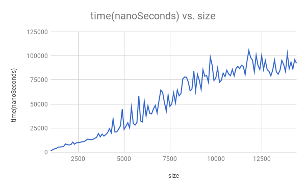

# Cookie
Members: Kevin Lin, Victor Lin, Kayli Matsuyoshi 	Rooster: Team 00

# Hypothesis
If we increase the size of the matrix used in our search method, then the run time for matrix search will increase linearly.

# Background

# Experiment Methodology
The computer performs 100 trials for every 100 increment of matrix size, starting at size 1000. For each trial, the computer adds the run time to a variable which will be averaged out( sum / 100 ) at the end. This number is the recorded datum.  Every trial searches for the bottom left corner of the matrix.
The experiment was run with one gigabyte of RAM allocated for it, and it runs the search method 10000 times on a 1000x1000 matrix before recording data, because it was noticed that the first few matrix sizes had abnormally long runtimes.

# Results

# Conclusion
Based on the data, the method first starts with non linear time for small matrixes. As the size of the matrixes increase, the method's runtime becomes linear.
